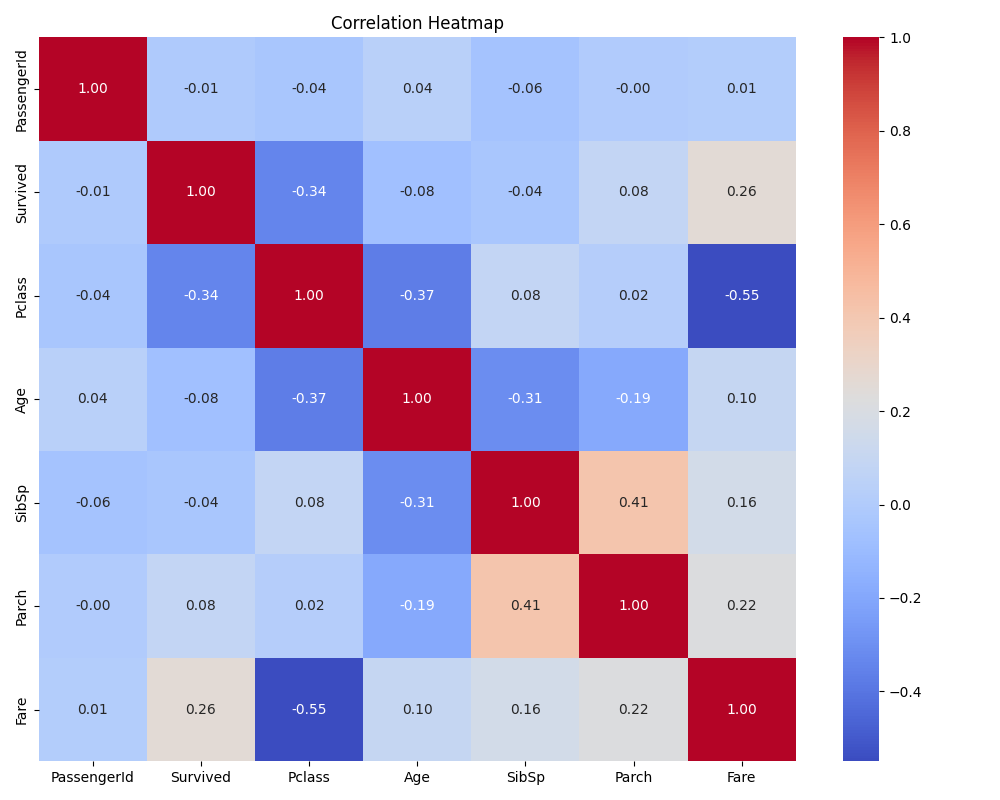

# Task 2: Titanic Dataset EDA

## Overview
This project performs Exploratory Data Analysis (EDA) on the famous Titanic dataset to uncover patterns and insights about passenger survival rates and characteristics.

## Project Structure

```
├── Data/
│   └── Titanic-Dataset.csv
├── Outputs/
│   ├── Eda_Summary.csv
│   ├── cleaned_eda_titanic_data.csv
│   └── visuals/
│       ├── age_distribution.png
│       ├── fare_distribution.png
│       ├── fare_boxplot.png
│       ├── pairplot.png
│       └── correlation_heatmap.png
├── src/
│   ├── Eda_stats.py
│   ├── visuals.py
│   └── inference.py
└── main.py
```

---

## Key Visualizations

### Age Distribution


### Fare Distribution & Outliers

**Fare Distribution**


**Fare Boxplot**


### Feature Relationships

**Pairplot**


### Correlation Analysis

**Correlation Heatmap**


---

## Key Findings

* **First class passengers** had a survival rate of **62.96%**
* **Female passengers** had a survival rate of **74.20%**
* Most passengers were **young to middle-aged adults**
* **Significant fare outliers**, mostly in first class
* Missing values:

  * Age: 19.87%
  * Cabin: 77.10%

---

## Usage

1. **Install dependencies:**

```bash
pip install pandas numpy matplotlib seaborn
```

2. **Run the analysis:**

```bash
python main.py
```

---

## Data Description

The dataset contains 891 records with 12 columns:

| Column      | Description                     |
| ----------- | ------------------------------- |
| PassengerId | Unique ID                       |
| Survived    | Survival status (0=No, 1=Yes)   |
| Pclass      | Passenger class (1st, 2nd, 3rd) |
| Name        | Passenger name                  |
| Sex         | Gender                          |
| Age         | Age in years                    |
| SibSp       | Siblings/Spouses aboard         |
| Parch       | Parents/Children aboard         |
| Ticket      | Ticket number                   |
| Fare        | Passenger fare                  |
| Cabin       | Cabin number                    |
| Embarked    | Port of embarkation (C, Q, S)   |

---

## Output Files

* `Eda_Summary.csv`: Statistical summary
* `cleaned_eda_titanic_data.csv`: Processed dataset
* `visuals/`: All generated plots

---

## Technologies Used

* Python 3.12
* Pandas
* NumPy
* Matplotlib
* Seaborn

---

**Author:** Mamoon Khan
**Date:** 2025-10-21
**Made with ❤️ for Data Exploration**